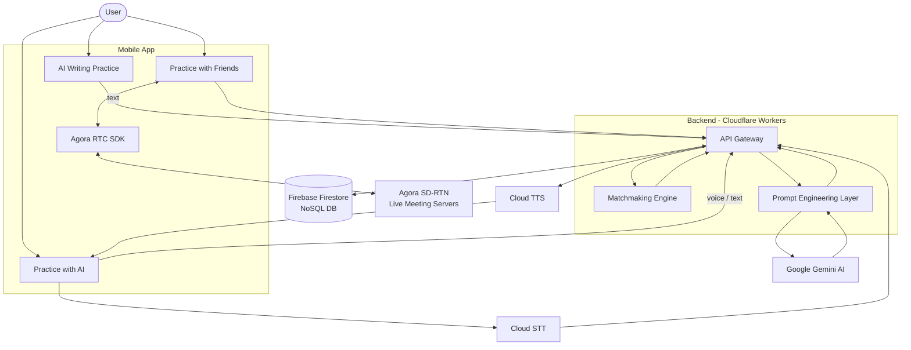
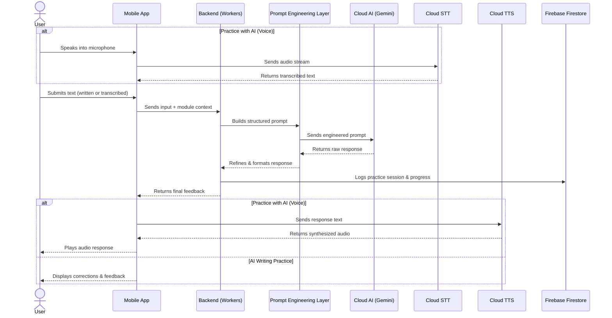
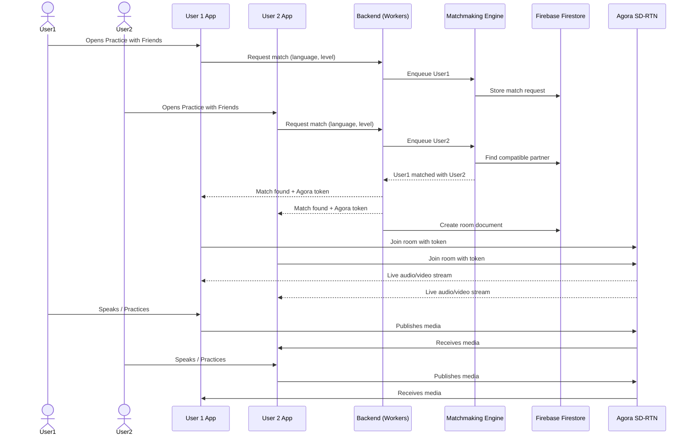

# AI Language Practice App - Ecosystem & Integration

This document provides a high-level overview of the application's ecosystem. It focuses on how the mobile application interacts with various external services, cloud infrastructure, and AI models to deliver a seamless language learning and practice experience.

## 1. High-Level Ecosystem Diagram

This diagram illustrates the main connections between the user's device (the App) and the external services that power it.

## 2. Use Case Diagram

```mermaid
graph TB
    classDef actor fill:#e1f5fe,stroke:#01579b,stroke-width:2px
    classDef system fill:#fff,stroke:#333,stroke-width:2px
    classDef include fill:#fff3e0,stroke:#e65100,stroke-dasharray: 5 5
    classDef extend fill:#e8f5e9,stroke:#2e7d32,stroke-dasharray: 5 5

    User([User])

    subgraph Authentication[Authentication]
        A1(Sign Up)
        A2(Sign In)
        A3(Sign In with Google)
        A4(Reset Password)
        A5(Sign Out)
    end

    subgraph AIPractice[AI Conversation Practice]
        B1(Browse Role-Play Scenarios)
        B2(Create Custom Scenario)
        B3(Start AI Conversation)
        B4(Speak via Microphone)
        B5(Receive AI Voice Response)
        B6(Finish Session & Get Evaluation)
        B7(Interrupt AI Speaking)
        B8(Reset Conversation)
    end

    subgraph WritingPractice[Writing Practice]
        C1(Select Writing Scenario)
        C2(Submit Writing for Analysis)
        C3(View Writing Analysis)
    end

    subgraph FriendPractice[Friend Practice]
        D1(View Peer Dashboard)
        D2(Enter Waiting Room)
        D3(Find a Partner)
        D4(Join Voice Call)
        D5(Mute / Unmute)
        D6(Leave Call)
    end

    subgraph ProfileProgress[Profile & Progress]
        E1(View Profile)
        E2(Edit Profile)
        E3(View Progress & Insights)
        E4(View Score Trends)
        E5(View Session History)
        E6(View Analysis Dashboard)
        E7(View Help & Support)
    end

    subgraph AppSettings[App Settings]
        F1(Toggle Dark Mode)
        F2(Select Voice Engine)
    end

    Gemini(Google Gemini AI)
    FirebaseAuth(Firebase Auth)
    Firestore(Firebase Firestore)
    Agora(Agora SD-RTN)
    CloudSTT(Cloud STT)
    CloudTTS(Cloud TTS)
    LocalONNX(Local ONNX Engine)

    User --> A1 & A2 & A3 & A4 & A5
    User --> B1 & B2 & B3 & B4 & B5 & B6 & B7 & B8
    User --> C1 & C2 & C3
    User --> D1 & D2 & D3 & D4 & D5 & D6
    User --> E1 & E2 & E3 & E4 & E5 & E6 & E7
    User --> F1 & F2

    C2 -.->|<<include>>| C1
    D2 -.->|<<include>>| D3
    D4 -.->|<<include>>| D3
    E3 -.->|<<include>>| E4
    E3 -.->|<<include>>| E5

    B4 -.->|<<extend>>| B7
    B3 -.->|<<extend>>| B8
    D4 -.->|<<extend>>| D5
    D4 -.->|<<extend>>| D6

    A1 --> FirebaseAuth
    A2 --> FirebaseAuth
    A3 --> FirebaseAuth
    A4 --> FirebaseAuth
    A5 --> FirebaseAuth

    A1 --> Firestore

    B3 --> Gemini
    B5 --> Gemini
    B6 --> Gemini

    B4 --> CloudSTT
    B4 --> LocalONNX

    B5 --> CloudTTS
    B5 --> LocalONNX

    C2 --> Gemini

    D4 --> Agora
    D5 --> Agora
    D6 --> Agora

    B6 --> Firestore
    C2 --> Firestore
    D2 --> Firestore
    D3 --> Firestore
    D4 --> Firestore
    D6 --> Firestore
    E1 --> Firestore
    E2 --> Firestore
    E3 --> Firestore
    E4 --> Firestore
    E5 --> Firestore
    E6 --> Firestore
```

## 3. Core Service Integrations

### Firebase Firestore (Data Layer)
*   **Role:** Primary NoSQL database for the entire app.
*   **Integration:** Stores user profiles, progress tracking, practice history, room metadata, and matchmaking queues. Accessed by the backend API via CRUD operations.

### Google Gemini AI (Cloud AI)
*   **Role:** Core LLM powering all AI-driven practice modules.
*   **Usage:**
    *   **AI Writing Practice** — evaluates written text, provides grammar corrections, and suggests improvements.
    *   **Practice with AI** — drives conversational AI tutor with voice input/output.
*   Both modules integrate through a **Prompt Engineering Layer** hosted on the backend, which structures prompts, manages context windows, and refines raw model responses before returning them to the app.

### Cloud STT & TTS (Cloud AI)
*   **Role:** Enable voice interactions in the Practice with AI module.
*   **Integration:** Audio streams from the user are sent to cloud-based Speech-to-Text for transcription; AI responses are synthesized via cloud Text-to-Speech and streamed back as audio. Both models are hosted on cloud infrastructure (not on-device).

### Agora SDK (Live Communication)
*   **Role:** Real-time audio/video communication for Practice with Friends.
*   **Integration:** The app embeds the Agora RTC SDK. When a user joins or creates a practice room, the app connects to Agora's SD-RTN (Software Defined Real-Time Network) servers to enable low-latency live meetings with matched partners.

### Matchmaking Engine (Backend)
*   **Role:** Matchmaking logic for the Practice with Friends module.
*   **Integration:** The backend (Cloudflare Workers) runs a matchmaking engine that pairs users based on language, proficiency level, and availability. Once matched, room metadata is stored in Firestore and Agora tokens are issued for the live session.

## 4. High-Level User Flow Diagrams

### AI Practice Flow (Writing / Practice with AI)

### Practice with Friends Flow

