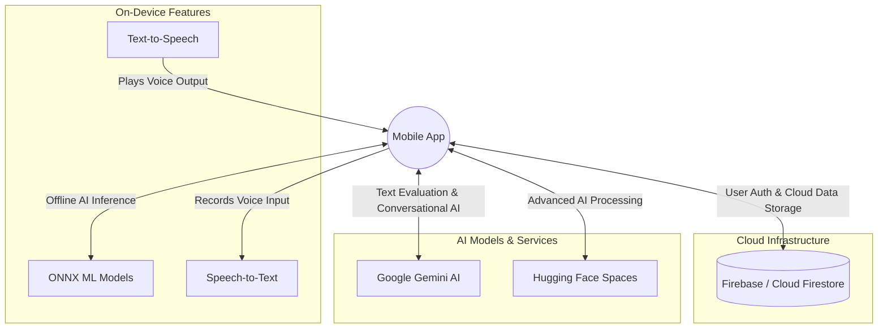
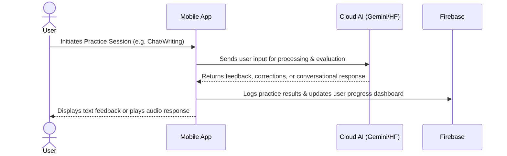

# AI Language Practice App - Ecosystem & Integration

This document provides a high-level overview of the application's ecosystem. It focuses on how the mobile application interacts with various external services, cloud infrastructure, and AI models to deliver a seamless language learning and practice experience.

## 1. High-Level Ecosystem Diagram

This diagram illustrates the main connections between the user's device (the App) and the external services that power it.

## 2. Core Service Integrations

The app relies on several key external and internal services to power its main modules:

### Firebase (Cloud Infrastructure)
*   **Authentication:** Securely manages user sign-ups, logins, and identity verification.
*   **Cloud Firestore:** Acts as the primary database. It stores user profiles, tracks progress (visualized on the Profile dashboard), and maintains practice history.

### Google Gemini AI
*   **Role:** The primary "brain" for language evaluation and conversation.
*   **Integration:** The app communicates with Gemini to evaluate written text (Writing Practice), provide grammatical corrections, and power the conversational AI tutor (Chat Practice).

### Hugging Face Spaces & On-Device AI (ONNX)
*   **Role:** Specialized AI processing for audio and advanced interactions.
*   **Integration:** Hugging Face endpoints can be used to provide advanced, specialized AI tasks. Additionally, the app uses ONNX to run machine learning models directly on the user's device, enabling faster responses and offline capabilities for specific AI tasks.

### Native Speech Services
*   **Role:** Enabling voice interactions.
*   **Integration:** The app utilizes device-native Speech-to-Text (STT) for capturing user speech in the "AI Model Speaker" module, and Text-to-Speech (TTS) to provide audible AI responses, creating a realistic, real-time conversational experience.

## 3. High-Level User Flow Diagram

This diagram shows a typical, high-level interaction flow when a user engages with one of the AI practice modules.

